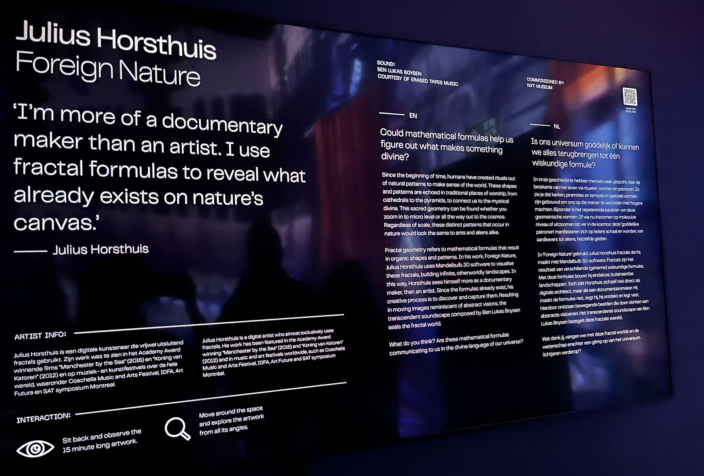

# Exploring the Future of Art at NXT Museum

For one of our weekly nerd days, we visited NXT Museum in Amsterdam! It was my very first time being there, so I was curious and excited about what kind of artworks would be showcased to us. NXT Museum stands as a pioneering institution dedicated to showcasing the art of the future. With a profound focus on new media art, this museum encapsulates the dynamic relationship between modern tools and contemporary times. It is all about breaking free from conventional artistic norms. It is basically like stepping into a world where art meets technology. At NXT Museum, they've harnessed the power of modern tools to capture the essence of our fast-paced times.

During our visit, most of the exhibitions were interactive. For me, it was rather hard to 'see' or 'feel' the art in these exhibitions. When it comes to the world of art, everyone has their own tastes and preferences. Personally, I find myself drawn to the allure of historic and traditional art or put more simply; the classical forms of artistic expression. I find it to be more captivated by the craftsmanship and tangible skills employed by the artists. Why? The undeniable presence of hard skills and meticulous craftsmanship. In the creation of these masterpieces, artists dedicated countless hours, honing their skills and perfecting their techniques. With every stroke of the brush or chisel, they brought their visions to life on canvas or stone, pouring their souls into the artwork.  

In contrast, the modern, vague, and techy art showcased at NXT Museum, while undoubtedly innovative and thought-provoking for many, did not resonate with me. With tech-driven art, it sometimes (to me) feels as if the line between artist and machine becomes blurred, as anyone with access to the right software or equipment could potentially create similar pieces. While I don't necessarily find anything wrong with this, since I think it is great to explore new artistic mediums, I personally find more fulfillment in the traditional techniques. I often find myself struggling to discern the intended meaning or connection within abstract compositions, hence why I did not connect with any of the exhibitions at NXT Museum. But, that does not mean I did not enjoy or was enthusiastic about any of the exhibitions. There was one exhibition that stood out to me the most.

## Foreign Nature by Julius Horsthuis

The "Foreign Nature" exhibition invited us on a captivating journey. Through the use of computer-generated fractals, Horsthuis creates shapes, patterns, and cosmic landscapes that come alive. I knew none of it was real, but it felt as if the piece was revealing the hidden beauty of the universe.

### Technical and Design Analysis

When I had first walked into the exhibition, I was mindblown. It was being displayed in a big square room with nothing but a few benches put against the wall. It felt almost illegal to walk in the space of the imagery that was being projected onto the walls and floors, thus I decided to sit down on one of the benches. I was not even sure what I was looking at, but my first thought was "this must have taken a lot of effort". It looked like a lot of 3D rendering and a ton of calculations to create seamless patterns that transitioned into one another. 

After staring at the shapes and patterns for several minutes, I walked up to the details board containing information about the artwork itself. To my surprise, the artistic genius behind "Foreign Nature" lies in mathematics (or just the world of computer-generated fractals as Horsthuis calls it)! Fractals, as seen in the GIF above, are shapes that create fascinating patterns and repeating structures at varying scales. Horsthuis approached his as a naturalist or documentary filmmaker, which I thought makes sense, because it had genuinely felt like I was being taken on a journey to extraterrestrial landscapes.

"Foreign Nature" by design pushes the boundaries of artistic expression by fusing mathematics with immersive visuals and sound, creating a captivating experience for the viewer. I think the exhibition invites you to think about the mysteries of the universe and appreciate the inherent beauty that exists within complex structures.

## Reflection

As mentioned before I did not connect with any of the exhibitions at NXT Museum, simply due to my preferences when it comes to art. Neither did it change or trigger a lightbulb moment inside of my brain regarding web development. I have no doubt that you could create wonderful pieces like "Foreign Nature" with Javascript and CSS, and that others might find that super exciting to dive into, but that is not the case for me. I might sound negative or downplay the efforts of these exhibitions (which is not the case, just a personal preference!), but I did however have fun at the museum and enjoyed my time! 